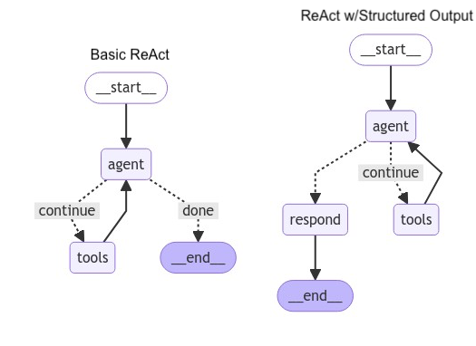
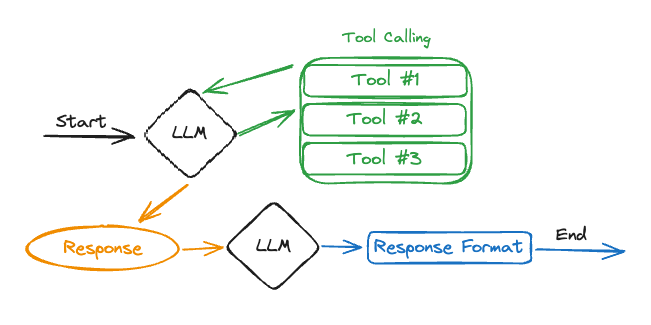

**How to return structured output with a ReAct style agent**

You might want your agent to return its output in a structured format. For example, if the output of the agent is used by some other downstream software, you may want the output to be in the same structured format every time the agent is invoked to ensure consistency.

This notebook will walk through two different options for forcing a function calling agent to structure its output. We will be using a basic ReAct agent (a model node and a tool-calling node) together with a third node at the end that will format response for the user. Both of the options will use the same graph structure as shown in the diagram below, but will have different mechanisms under the hood.

Option 1

The first way you can force your tool calling agent to have structured output is to bind the output you would like as an additional tool for the agent node to use. In contrast to the basic ReAct agent, the agent node in this case is not selecting between tools and END but rather selecting between the specific tools it calls. The expected flow in this case is that the LLM in the agent node will first select the action tool, and after receiving the action tool output it will call the response tool, which will then route to the respond node which simply structures the arguments from the agent node tool call.

Pros and Cons

The benefit to this format is that you only need one LLM, and can save money and latency because of this. The downside to this option is that it isn't guaranteed that the single LLM will call the correct tool when you want it to. We can help the LLM by setting tool_choice to any when we use bind_tools which forces the LLM to select at least one tool at every turn, but this is far from a fool proof strategy. In addition, another downside is that the agent might call multiple tools, so we need to check for this explicitly in our routing function (or if we are using OpenAI we an set parallell_tool_calling=False to ensure only one tool is called at a time).

Option 2

The second way you can force your tool calling agent to have structured output is to use a second LLM (in this case model_with_structured_output) to respond to the user.

In this case, you will define a basic ReAct agent normally, but instead of having the agent node choose between the tools node and ending the conversation, the agent node will choose between the tools node and the respond node. The respond node will contain a second LLM that uses structured output, and once called will return directly to the user. You can think of this method as basic ReAct with one extra step before responding to the user.

Pros and Cons

The benefit of this method is that it guarantees structured output (as long as .with_structured_output works as expected with the LLM). The downside to using this approach is that it requires making an additional LLM call before responding to the user, which can increase costs as well as latency. In addition, by not providing the agent node LLM with information about the desired output schema there is a risk that the agent LLM will fail to call the correct tools required to answer in the correct output schema.

Note that both of these options will follow the exact same graph structure (see the diagram above), in that they are both exact replicas of the basic ReAct architecture but with a respond node before the end.

Reference:- https://langchain-ai.github.io/langgraph/how-tos/react-agent-structured-output/